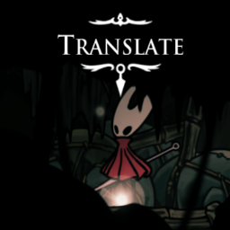

# Simple Silksong Localizer


This mod makes it (relatively) easy to replace text, add translatable text, and add entire new languages to the game.

## Installation

1. Download and install [BepInExPack Silksong]([https://thunderstore.io/c/hollow-knight-silksong/p/BepInEx/BepInExPack_Silksong/](https://raw.githubusercontent.com/capitalistspz/SimpleSilksongLocalizer/master/icon.png).
2. Download this mod and place it in `<BepInEx Folder>/plugins`

## Usage
Usage of this mod revolves around creating translation sheets.

A translation sheet is an XML document containing many key (used for lookup) and value (displayed to user) pairs formatted as such:
```xml
<entries>
    <entry name="KEY">Value</entry>
    <entry name="Hello">World!</entry>
</entries>
```

### Adding localization directories
The mod automatically registers directories as *localization directories* if their path is
`<BepInEx folder>/plugins/*/SSL.Localization/`.

For example with a layout like this:
```
└── BepInEx
    └── plugins
        ├── AmazingMod
        │   └── SSL.Localization
        │       └── EN
        │           └── MainMenu
        ├── Mod
        │   └── Sub
        │       └── SSL.Localization
        ├── Mod1
        ├── MyMod
        │   └── SSL.Localization
        └── MyOtherMod
            └── Nope

```

Only `MyMod/SSL.Localization` and `AmazingMod/SSL.Localization` are registered as *localization directories*.

Additional directories can be registered with code that calls 
`SimpleSilkongLocalizerPlugin.AddLocalizationDirectory(string localizationDirectory)`.
(This requires creating a C# project that uses this as a dependency)

### Replacing game text
To replace text, you must create a sheet with an entry that has the same key.
The sheet must also be named to match the original sheet, but with a slight adjustment.

The game's original sheets are in files named `<language code>_<sheet title>`, 
but this mod looks for files in the *localization directory* named `<language code>/<sheet title>`.

Example: Replace the "Start Game" text on the main menu with "Don't Start Game" for English.
This text is usually kept in the `EN_MainMenu` sheet

`<localization directory>/EN/MainMenu`
```
<entries>
    <entry name="MAIN_START">Don&apos;t Start Game</entry>
</entries>
```
Please note: `&apos;` is used to insert an apostrophe `'`, because [it cannot be used directly for XML values, along with some other characters](https://stackoverflow.com/questions/1091945/what-characters-do-i-need-to-escape-in-xml-documents).

### Adding new translatable text keys

1. Create a new sheet somewhere in a localization directory (e.g. `EN/Sheet1`)
2. Inside your *localization directory*, create `LocalizationSettings.json`,
3. In `LocalizationSettings.json` set the `CustomSheets` key to an array of paths to sheets you'd like to add.

```json
{
  "CustomSheets": [
    "Sheet1",
    "subdirectory/mysheet"
  ]
}
```

#### Fallbacks
If you are not providing sheets for every available language
(default: DE, EN, ES, FR, IT, JA, KO, PT, RU, ZH), 
and would like for text from another language to be displayed instead of 
user-unfriendly sheet-key pair strings:

Set the `Fallback` key. This allows you to set which language to fallback on if text is missing, 
as well as exclude certain languages from displaying text from the fallback language.

```json
{
  "CustomSheets": [
    "Sheet1",
    "subdirectory/mysheet"
  ],
  "Fallback": {
    "Language": "EN",
    "Excluded": []
  }
}
```
